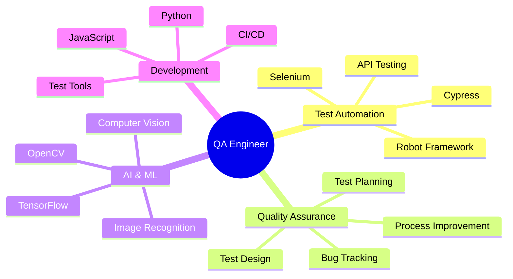

# 🚀 Ernani Neto
### 💻 QA Engineer & Test Automation Specialist

---

## 🎯 Sobre Mim

Sou um **QA Engineer** apaixonado por automação de testes e qualidade de software, com expertise em:

- 🔍 **Garantia de Qualidade** com foco em processos e automação
- 🤖 **Automação de Testes** usando Cypress, Selenium e Robot Framework
- 🧠 **Inteligência Artificial** aplicada à segurança e visão computacional
- 📊 **Análise de Dados** e otimização de processos de teste
- 🚀 **Desenvolvimento de Ferramentas** para aumentar produtividade

 

---

## 🛠️ Stack Tecnológica

### 🧪 Testing & QA

### 💻 Linguagens

### 🤖 AI & Machine Learning

### 🔧 Ferramentas & Plataformas

---

## 🏆 Projetos em Destaque

### 🎯 [CyGen - Cypress Test Generator](https://github.com/Ernani1234/cygen)

**🚀 Ferramenta Avançada de Geração de Testes Cypress com IA**

- 🎯 **Captura Inteligente**: Registra interações do usuário automaticamente
- 🤖 **Geração com IA**: Cria testes Cypress usando inteligência artificial
- ✨ **Editor Assistido**: Interface moderna com suporte a comandos personalizados
- 📊 **Controle de Custos**: Monitoramento preciso do uso de API
- 🎨 **Interface Visual**: Tema escuro responsivo e intuitivo

**Tecnologias:** Python, Selenium, tkinter, OpenAI API, Cypress

---

### 🏠 [Home Security AI](https://github.com/Ernani1234/home-security-AI)

**🛡️ Sistema de Segurança Residencial com Inteligência Artificial**

- 🧠 **IA Avançada**: Reconhecimento e aprendizado com imagens
- 📹 **Visão Computacional**: Detecção inteligente de movimentos
- 🔔 **Alertas em Tempo Real**: Notificações instantâneas
- 📱 **Interface Intuitiva**: Dashboard moderno e responsivo
- 🔒 **Segurança Robusta**: Proteção de dados e privacidade

**Tecnologias:** Python, TensorFlow, OpenCV, Computer Vision, Machine Learning

---

## 📊 Estatísticas GitHub

---

## 🎓 Certificações & Formações

| 🏆 Certificação | 🏢 Instituição | 📅 Ano |
|:---|:---|:---:|
| **Formação Carreira QA: Processos e Automação** | Alura | 2024 |
| **JavaScript Completo** | Alura | 2024 |
| **Robot Framework** | Alura | 2024 |
| **Teste de Software** | Udemy | 2024 |
| **LGPD - Lei Geral de Proteção de Dados** | Certificação Completa | 2024 |
| **Empreendedorismo e Negócios** | Curso Especializado | 2024 |

---

## 🎯 Áreas de Expertise

---

## 🌟 Destaques Profissionais

### 🎯 **Especialista em Automação de Testes**
*Desenvolvimento de frameworks robustos e ferramentas inovadoras*

### 🤖 **Integração de IA em QA**
*Aplicação de inteligência artificial para otimizar processos de teste*

### 🚀 **Inovação Tecnológica**
*Criação de soluções que aumentam produtividade e qualidade*

---

## 📈 Atividade de Contribuições

---

## 🎨 Onde Encontrar GIFs e Animações

Para tornar seu README ainda mais dinâmico, você pode adicionar GIFs nas seguintes seções:

### 📍 **Header Section**
- GIF de coding/programming
- Animação de typing effect
- Logo animado

### 🛠️ **Tech Stack**
- GIFs de cada tecnologia em ação
- Animações de ferramentas sendo usadas

### 🏆 **Projects Section**
- Demos dos projetos em GIF
- Screenshots animados
- Workflow demonstrations

### 📊 **Stats Section**
- Gráficos animados
- Contadores dinâmicos
- Progress bars

---

## 🤝 Vamos Conectar!

 <em><b>Adoro conectar com pessoas diferentes!</b> Se você quer conversar sobre QA, automação de testes, IA ou qualquer coisa tech, sinta-se à vontade para me chamar!</em>

---

### 💬 *"A qualidade nunca é um acidente; é sempre o resultado de um esforço inteligente."*

---

**⭐ Se você gostou dos meus projetos, não esqueça de dar uma estrela!**

