#  **Ernani Mendes da Fonseca Neto**
###  Engenheiro de Computação | QA Engineer | Test Automation Specialist

---

## 🚀 Sobre Mim

Sou um **Engenheiro da Computação** apaixonado por **Quality Assurance** e **Inteligência Artificial**, com uma trajetória sólida em automação de testes e desenvolvimento de soluções inovadoras. Minha experiência abrange desde a criação de frameworks de teste robustos até o desenvolvimento de sistemas de IA para segurança residencial.

### 🎯 **Minha Missão**
Transformar processos manuais em soluções automatizadas inteligentes, garantindo a qualidade e eficiência em cada linha de código. Acredito que a combinação entre QA rigoroso e IA inovadora é o futuro do desenvolvimento de software.

### 💡 **O que me Move**
- **Automação Inteligente:** Desenvolvimento de ferramentas que não apenas automatizam, mas aprendem e se adaptam
- **Qualidade Excepcional:** Busca constante pela excelência em testes e validação de software
- **Inovação Tecnológica:** Aplicação de IA em cenários reais, especialmente em segurança e automação
- **Aprendizado Contínuo:** Sempre explorando novas tecnologias e metodologias

### 🏆 **Destaques da Carreira**
- ✅ **Especialista em Cypress e Selenium** com projetos de automação complexos
- ✅ **Desenvolvedor de IA** com foco em Computer Vision e Machine Learning
- ✅ **Criador do CyGen** - ferramenta revolucionária para geração de testes automatizados
- ✅ **Arquiteto de Soluções** em sistemas de segurança baseados em IA
- ✅ **Certificações Técnicas** em diversas tecnologias e metodologias

---

## 💼 Experiência Profissional

### **Estagiário em QA (Quality Assurance) – Inovvati Tecnologia**
*   **Período:** 1 ano
*   **Responsabilidades e Conquistas:**
    *   Atuação proativa no desenvolvimento e execução de **testes automatizados**, garantindo a cobertura e a eficiência dos processos.
    *   Elaboração e manutenção de **casos de testes** detalhados, cobrindo funcionalidades, regressão e testes de carga.
    *   Identificação, documentação e acompanhamento de defeitos, assegurando a **qualidade do software** e a melhoria contínua dos produtos.
    *   Colaboração com equipes de desenvolvimento para integrar práticas de QA no ciclo de vida do software.

### **Desenvolvedor de Inteligência Artificial**
*   **Período:** 1 mês
*   **Responsabilidades e Conquistas:**
    *   Desenvolvimento e implementação de **soluções de IA**, explorando algoritmos e modelos para resolver desafios específicos.
    *   Contribuição para projetos que envolvem a aplicação de inteligência artificial em diversos contextos tecnológicos.

---

## 🎓 Formação Acadêmica

*   **Bacharelado em Engenharia da Computação**
    *   Universidade Católica Dom Bosco, Campo Grande-MS
    *   Conclusão: 2025 

*   **Ensino Médio Completo**
    *   Colégio Nova Geração, Campo Grande-MS
    *   Conclusão: 2019

---

## 🏆 Certificações & Formações Complementares

Minha dedicação ao aprimoramento contínuo é evidenciada por uma série de certificações que abrangem desde a garantia de qualidade e automação de testes até o desenvolvimento em linguagens chave e conhecimentos em áreas emergentes como a Lei Geral de Proteção de Dados (LGPD).

| Certificação | Instituição | Data de Conclusão | Carga Horária/Duração |
|:---|:---|:---:|:---:|
| **Formação Carreira QA: Processos e Automação de Testes** | Alura | 24 de janeiro de 2025 | 52 horas |
| **Quality Assurance: Plano de Testes e Gestão de Bugs** | Alura | 17 de janeiro de 2025 | 8 horas |
| **Robot Framework: Automatizando Testes no Padrão BDD** | Alura | 24 de janeiro de 2025 | 8 horas |
| **Lógica de Programação: Mergulhe em Programação com JavaScript** | Alura | 20 de janeiro de 2025 | 6 horas |
| **JavaScript [40 Horas]** | Curso em Vídeo | 10 de setembro de 2024 | 40 horas |
| **Teste de Software: Seja um Expert e Impulsione Sua Carreira** | Udemy | 18 de novembro de 2024 | 3 horas |
| **LGPD - Módulo 1** | Inovvati Tecnologia / Contato Seguro | 24 de junho de 2025 | - |
| **LGPD - Módulo 2** | Inovvati Tecnologia / Contato Seguro | 24 de junho de 2025 | - |
| **LGPD - Módulo 3** | Inovvati Tecnologia / Contato Seguro | 24 de junho de 2025 | - |
| **LGPD - Treinamento/Palestra** | Inovvati Tecnologia / Contato Seguro | 24 de junho de 2025 | - |
| **Empreendedorismo e Negócios - Do MS para o Mundo** | Universidade Católica Dom Bosco (UCDB) | 19 de março de 2024 | 2 horas |
| **VIII Encontro da Rede PDIMAT - ECG2022** | Universidade Católica Dom Bosco (UCDB) | 07 a 09 de novembro de 2022 | 19 horas |
| **XIV ENGMEC MS - 14º Encontro Regional dos Engenheiros Mecânico e Industrial de Mato Grosso do Sul** | Universidade Católica Dom Bosco (UCDB) | 28 de março de 2023 | 7 horas |

---

## 🛠️ Stack Tecnológica & Expertise

Minha proficiência técnica abrange um espectro diversificado de linguagens, frameworks e ferramentas, com um foco especial em **Quality Assurance** e **Inteligência Artificial**. Abaixo, detalho as principais tecnologias e áreas de expertise que utilizo para desenvolver soluções robustas e inovadoras.

### 🧪 Testing & QA

### 💻 Linguagens de Programação

### 🤖 AI & Machine Learning

### 🔧 Ferramentas & Plataformas

---

## 🧠 Áreas de Expertise em Diagrama

Para uma visão mais estruturada das minhas áreas de expertise e como elas se interligam, apresento o seguinte diagrama:

```mermaid
graph TD
    A[🧠 Ernani Neto - Expertise] --> B[🧪 Quality Assurance]
    A --> C[🤖 Inteligência Artificial]
    A --> D[💻 Desenvolvimento]
    
    B --> B1[Test Automation]
    B --> B2[Manual Testing]
    B --> B3[Test Management]
    
    B1 --> B1a[Cypress]
    B1 --> B1b[Selenium]
    B1 --> B1c[Robot Framework]
    B1 --> B1d[Jest]
    
    B2 --> B2a[Functional Testing]
    B2 --> B2b[Regression Testing]
    B2 --> B2c[Load Testing]
    
    B3 --> B3a[Jira]
    B3 --> B3b[TestRail]
    B3 --> B3c[Bug Tracking]
    
    C --> C1[Computer Vision]
    C --> C2[Machine Learning]
    C --> C3[Security AI]
    
    C1 --> C1a[OpenCV]
    C1 --> C1b[Image Processing]
    C1 --> C1c[Pattern Recognition]
    
    C2 --> C2a[TensorFlow]
    C2 --> C2b[Scikit-Learn]
    C2 --> C2c[Neural Networks]
    
    C3 --> C3a[Home Security]
    C3 --> C3b[Anomaly Detection]
    C3 --> C3c[Real-time Alerts]
    
    D --> D1[Languages]
    D --> D2[Tools & Platforms]
    D --> D3[Databases]
    
    D1 --> D1a[Python]
    D1 --> D1b[JavaScript/TypeScript]
    D1 --> D1c[C/C#/Java]
    D1 --> D1d[SQL]
    
    D2 --> D2a[Git/GitHub]
    D2 --> D2b[Docker]
    D2 --> D2c[Jenkins/CI-CD]
    D2 --> D2d[VS Code/PyCharm]
    
    D3 --> D3a[PostgreSQL]
    D3 --> D3b[Database Design]
    D3 --> D3c[Query Optimization]
    
    classDef mainNode fill:#00D9FF,stroke:#fff,stroke-width:3px,color:#000
    classDef qaNode fill:#4ecdc4,stroke:#fff,stroke-width:2px,color:#000
    classDef aiNode fill:#ff6b6b,stroke:#fff,stroke-width:2px,color:#000
    classDef devNode fill:#96ceb4,stroke:#fff,stroke-width:2px,color:#000
    classDef toolNode fill:#feca57,stroke:#fff,stroke-width:1px,color:#000
    
    class A mainNode
    class B,B1,B2,B3 qaNode
    class C,C1,C2,C3 aiNode
    class D,D1,D2,D3 devNode
    class B1a,B1b,B1c,B1d,B2a,B2b,B2c,B3a,B3b,B3c,C1a,C1b,C1c,C2a,C2b,C2c,C3a,C3b,C3c,D1a,D1b,D1c,D1d,D2a,D2b,D2c,D2d,D3a,D3b,D3c toolNode
```

---

## 🚀 Projetos em Destaque

Meus projetos refletem a aplicação prática de minhas habilidades em QA, automação e inteligência artificial, resultando em soluções inovadoras e eficientes que demonstram minha paixão por tecnologia e qualidade de software.

### 🎯 [CyGen - Cypress Test Generator](https://github.com/Ernani1234/cygen)

**Descrição:** Uma ferramenta revolucionária para a **geração automatizada de testes Cypress**, utilizando o poder da inteligência artificial para otimizar o processo de desenvolvimento e manutenção de testes. O CyGen se destaca por sua capacidade de aprender e adaptar-se, proporcionando uma experiência de teste mais inteligente e menos suscetível a erros.

**🚀 Funcionalidades Principais:**
*   **🎯 Captura Inteligente de Interações:** Registra automaticamente as interações do usuário, transformando-as em scripts de teste robustos
*   **🤖 Geração de Testes com IA:** Emprega algoritmos avançados de IA para criar testes Cypress otimizados e eficientes
*   **✨ Editor Assistido e Personalizável:** Oferece uma interface intuitiva com suporte a comandos personalizados, elevando a produtividade do QA Engineer
*   **💰 Controle de Custos e Monitoramento:** Permite o monitoramento preciso do uso de API, garantindo a gestão eficiente dos recursos
*   **🎨 Interface Visual Moderna:** Apresenta um tema escuro responsivo e uma experiência de usuário fluida

**🛠️ Tecnologias:** `Python` • `Selenium` • `Tkinter` • `OpenAI API` • `Cypress` • `JavaScript`

---

### 🏠 [Home Security AI](https://github.com/Ernani1234/home-security-AI)

**Descrição:** Um sistema de segurança residencial inovador que integra **Inteligência Artificial** e **Visão Computacional** para oferecer monitoramento e proteção avançados. Este projeto demonstra a aplicação de IA em cenários de segurança, proporcionando detecção inteligente e alertas em tempo real.

**🛡️ Recursos Avançados:**
*   **🧠 IA Avançada para Reconhecimento:** Capacidade de aprender e reconhecer padrões em imagens para identificar atividades suspeitas
*   **👁️ Visão Computacional para Detecção:** Utiliza técnicas de processamento de imagem para detectar movimentos e anomalias no ambiente
*   **⚡ Alertas em Tempo Real:** Envia notificações instantâneas sobre eventos críticos, garantindo uma resposta rápida
*   **📱 Interface Intuitiva e Responsiva:** Um dashboard moderno que facilita o gerenciamento e a visualização das informações de segurança
*   **🔒 Segurança Robusta e Privacidade:** Projetado com foco na proteção de dados e na privacidade do usuário
*   **🎯 Detecção de Objetos Inteligente:** Reconhece pessoas, veículos e objetos suspeitos com alta precisão

**🛠️ Tecnologias:** `Python` • `TensorFlow` • `OpenCV` • `Computer Vision` • `Machine Learning` • `YOLO` • `Neural Networks`

---

## 📚 Projetos Acadêmicos Relevantes

Durante minha formação em Engenharia da Computação, participei de diversos projetos que consolidaram minhas habilidades técnicas e de resolução de problemas, com foco em áreas como automação, inteligência artificial e desenvolvimento de sistemas.

*   **Bot Treinado em Base de Conhecimento:** Desenvolvimento de um bot interativo para consulta e recuperação de informações, aplicando conceitos de processamento de linguagem natural e IA.
*   **Simulador de Autômatos Finitos:** Criação de uma ferramenta para simulação e visualização do comportamento de autômatos finitos, essencial para o estudo de teoria da computação.
*   **Gerador GLC (Gramáticas Livres de Contexto):** Implementação de um gerador de gramáticas livres de contexto, ferramenta fundamental para a análise sintática em compiladores.
*   **Circuito Medidor de Força:** Projeto e construção de um circuito eletrônico utilizando célula de carga, demonstrando conhecimentos em eletrônica e instrumentação.
*   **Analisador Léxico:** Desenvolvimento de um analisador léxico para processamento de linguagens, componente crucial na construção de compiladores e interpretadores.
*   **CRUD (Create, Read, Update, Delete):** Implementação de operações CRUD em sistemas, aplicando princípios de banco de dados e desenvolvimento web.
*   **Filtro de Partículas:** Projeto e aplicação de algoritmos de filtro de partículas, com foco em sistemas de rastreamento e estimação de estado.

---

## 📊 Estatísticas GitHub

Minha atividade e contribuições no GitHub refletem meu engajamento e paixão pelo desenvolvimento de software. Acompanhe minhas estatísticas e veja as linguagens que mais utilizo:

---

## 📈 Atividade de Contribuições

Meu gráfico de atividade demonstra a consistência e o volume das minhas contribuições em projetos de código aberto e repositórios privados, refletindo um compromisso contínuo com o desenvolvimento e a inovação.

### 🏆 **Conquistas Recentes**

---

## 🤝 Vamos Conectar!

 

### 💬 *"A qualidade nunca é um acidente; é sempre o resultado de um esforço inteligente."*

<em style="color: #E0E0E0; font-size: 1.1em;"><b>Adoro conectar com pessoas diferentes!</b> Se você quer conversar sobre QA, automação de testes, IA ou qualquer coisa tech, sinta-se à vontade para me chamar!</em>

### 🌟 **Conecte-se Comigo:**

---

**⭐ Se você gostou dos meus projetos, não esqueça de dar uma estrela! ⭐**

