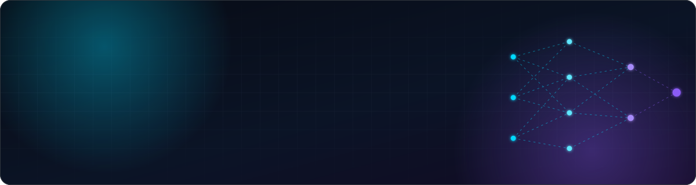
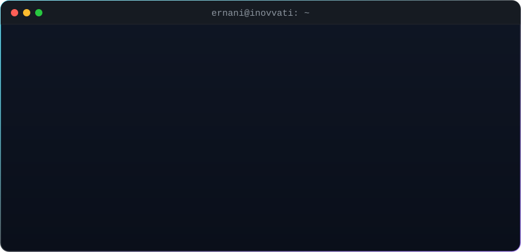
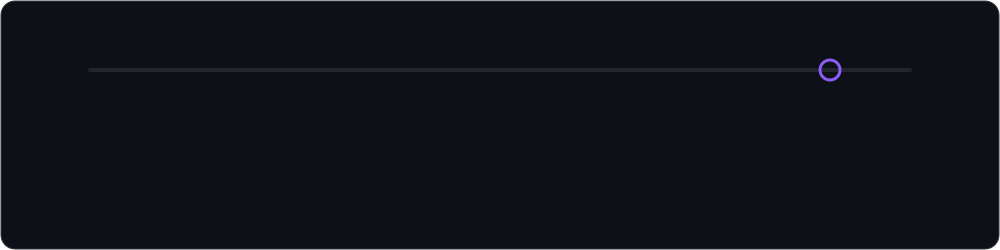
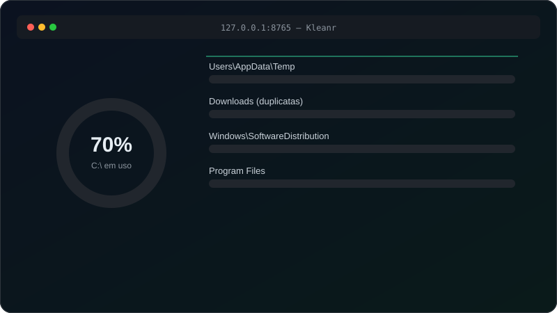
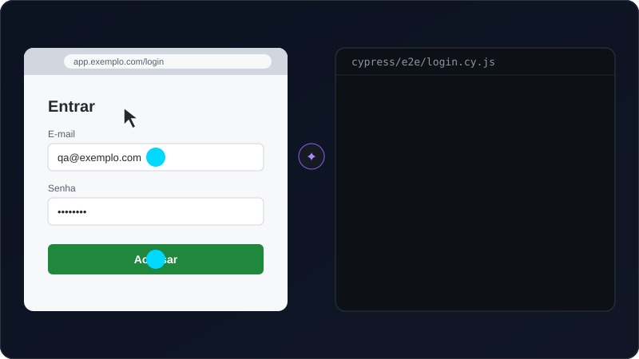

 

  

 

## `$ whoami`

  

 

Engenheiro da Computação que começou garantindo a qualidade do software dos outros e hoje constrói sistemas com **Inteligência Artificial** do protótipo à produção. Trabalho com **integração de LLMs**, **arquitetura de serviços** e aplicações completas em **Python, TypeScript e Rust** — sempre com foco em **processamento local, privacidade dos dados e cobertura de testes**.

- 🧠 **Agora:** arquitetura de uma plataforma de inteligência eleitoral com IA, integrando **13+ serviços** (Supabase, Neo4j, Redis, RabbitMQ, Firecrawl, Tavily, Notion, APIs Google…)
- 🗣️ **IA aplicada:** LLMs da OpenAI, síntese de voz com ElevenLabs, bots sobre bases de conhecimento
- 🔐 **Nos projetos pessoais:** criptografia autenticada, esteganografia em áudio, análise estática de código
- 🧪 **Background em QA:** testes E2E com Cypress, planos de regressão e carga — qualidade entra no design, não no fim
- 🌎 **Idiomas:** português (nativo) · inglês (fluente)

 

## 🧭 Trajetória

  

<b>Ver detalhes da experiência</b>

 

**Desenvolvedor de Sistemas com IA (Trainee) — Inovvati Tecnologia** · *2025 – atual*
- Desenvolvimento de sistemas com integração de LLMs e serviços de IA (OpenAI, síntese de voz com ElevenLabs), do protótipo à integração com o restante da aplicação.
- Arquitetura de uma plataforma de inteligência eleitoral com IA integrando 13+ serviços externos: Supabase, Neo4j, Redis, RabbitMQ, Firecrawl, Tavily, Notion e APIs Google.
- Módulos de monitoramento de redes, imprensa, campanha e visualização de dados.
- Levantamento e documentação de requisitos de um sistema de gestão de ofícios judiciais para órgão público (recebimento por e-mail → ordem de serviço → ofício de resposta).

**Analista de QA (Estágio) — Inovvati Tecnologia** · *2024 – 2025*
- Criação e manutenção de testes automatizados end-to-end com Cypress.
- Planos e casos de teste funcionais, de regressão e de carga.
- Identificação, documentação e acompanhamento de defeitos com o time de desenvolvimento.
- Capacitação interna em LGPD aplicada ao desenvolvimento de software.

**Bacharelado em Engenharia da Computação — UCDB** · *Campo Grande-MS · 2025*
- Projetos: analisador léxico, gerador de gramáticas livres de contexto, simulador de autômatos finitos, [filtro de partículas](https://github.com/Ernani1234/filtro-de-particulas), bot sobre base de conhecimento e circuito medidor de força com célula de carga.

 

## 🚀 Projetos em destaque

<table>
  <tr>
    <td width="50%" valign="top">
      
      <h3><a href="https://github.com/Ernani1234/codereader">CodeReader</a></h3>
      
Aponte para uma pasta e entenda o que há dentro. Varre o repositório, mapeia arquivos, funções, classes e imports, monta o <b>grafo de dependências</b> e gera painel navegável, diagramas e documentação exportável. Análise <b>100% local</b>; IA opcional para explicar funcionalidades.

      
      
      
    </td>
    <td width="50%" valign="top">
      
      <h3><a href="https://github.com/Ernani1234/passec">PASSEC</a></h3>
      
Cofre de credenciais <b>offline</b> com criptografia autenticada e <b>Argon2id</b>, 2FA (TOTP), Windows Hello e keyfile. Exporta o cofre como áudio e o esconde dentro de músicas (<b>esteganografia</b>). <b>162 testes automatizados.</b>

      
      
      
    </td>
  </tr>
  <tr>
    <td width="50%" valign="top">
      
      <h3><a href="https://github.com/Ernani1234/kleanr">Kleanr</a></h3>
      
Analisador de disco para Windows com interface web servida localmente (restrita a <code>127.0.0.1</code>). Mostra o uso de espaço, <b>classifica o que é seguro apagar</b>, encontra duplicatas e responde perguntas sobre as pastas com IA. Zero dependências; executável de 7,7 MB.

      
      
      
    </td>
    <td width="50%" valign="top">
      
      <h3><a href="https://github.com/Ernani1234/storyteller">Storyteller</a></h3>
      
Digite o nome de <b>qualquer obra</b> — filme, série, livro, anime ou jogo — e o app reconstrói toda a narrativa como uma <b>árvore interativa de capítulos</b> gerada por IA, para explorar no seu ritmo.

      
      
      
    </td>
  </tr>
  <tr>
    <td width="50%" valign="top">
      
      <h3><a href="https://github.com/Ernani1234/cygen">CyGen</a></h3>
      
Gerador de testes <b>Cypress com IA</b>: captura as interações no navegador, gera testes seguindo a estrutura do projeto, oferece editor assistido por IA e <b>controle de custo</b> de uso da API.

      
      
      
    </td>
    <td width="50%" valign="top">
      <h3>🧰 Outros projetos</h3>
      

        📦 <a href="https://github.com/Ernani1234/migration_verifier"><b>migration_verifier</b></a> 
        Verificador de migração de grandes volumes de dados — BigQuery, S3 e Redshift.
      

      

        📄 <a href="https://github.com/Ernani1234/pdf-writer"><b>pdf-writer</b></a> 
        Editor de PDF com diversas operações de manipulação.
      

      

        🗂️ <a href="https://github.com/Ernani1234/ultra-texto"><b>ultra-texto</b></a> 
        Consolida repositórios inteiros em um único arquivo de texto, além de clonar estruturas de pastas.
      

      

        ⌨️ <a href="https://github.com/Ernani1234/hubcommands_for_github"><b>hubcommands</b></a> 
        Hub de comandos de terminal explicados, com execução automática.
      

      

        🌦️ <a href="https://github.com/Ernani1234/winder"><b>winder</b></a> 
        Widget de previsão do tempo usando API pública.
      

      

        🎯 <a href="https://github.com/Ernani1234/filtro-de-particulas"><b>filtro-de-particulas</b></a> 
        Filtro de partículas para rastreamento e estimação de estado.
      

    </td>
  </tr>
</table>

 

## 🛠️ Stack

<table>
  <tr>
    <td align="center" width="140"><b>IA & LLMs</b></td>
    <td>
      &nbsp;
      
      
      
    </td>
  </tr>
  <tr>
    <td align="center"><b>Linguagens</b></td>
    <td></td>
  </tr>
  <tr>
    <td align="center"><b>Frameworks</b></td>
    <td></td>
  </tr>
  <tr>
    <td align="center"><b>Dados & Infra</b></td>
    <td>
      &nbsp;
      
    </td>
  </tr>
  <tr>
    <td align="center"><b>Testes & QA</b></td>
    <td>
      &nbsp;
      
      
    </td>
  </tr>
</table>

 

## 📊 Atividade

  
  

 

  <picture>
    <source media="(prefers-color-scheme: dark)" srcset="https://raw.githubusercontent.com/Ernani1234/Ernani1234/output/github-snake-dark.svg"/>
    <source media="(prefers-color-scheme: light)" srcset="https://raw.githubusercontent.com/Ernani1234/Ernani1234/output/github-snake.svg"/>
    
  </picture>

 

## 🏆 Certificações

<b>Ver certificações e formações complementares</b>

 

| Certificação | Instituição | Ano | Carga |
|:---|:---|:---:|:---:|
| Formação Carreira QA: Processos e Automação de Testes | Alura | 2025 | 52h |
| Quality Assurance: Plano de Testes e Gestão de Bugs | Alura | 2025 | 8h |
| Robot Framework: Automatizando Testes no Padrão BDD | Alura | 2025 | 8h |
| Lógica de Programação: Mergulhe em Programação com JavaScript | Alura | 2025 | 6h |
| LGPD — Módulos 1, 2 e 3 + Treinamento | Inovvati Tecnologia | 2025 | — |
| JavaScript | Curso em Vídeo | 2024 | 40h |
| Teste de Software: Seja um Expert | Udemy | 2024 | 3h |
| Empreendedorismo e Negócios — Do MS para o Mundo | UCDB | 2024 | 2h |
| XIV ENGMEC MS | UCDB | 2023 | 7h |
| VIII Encontro da Rede PDIMAT — ECG2022 | UCDB | 2022 | 19h |

 

### Vamos conversar?

Aberto a conversas sobre **IA aplicada**, **arquitetura de sistemas** e **qualidade de software**.

<i>"A qualidade nunca é um acidente; é sempre o resultado de um esforço inteligente." — John Ruskin</i>

